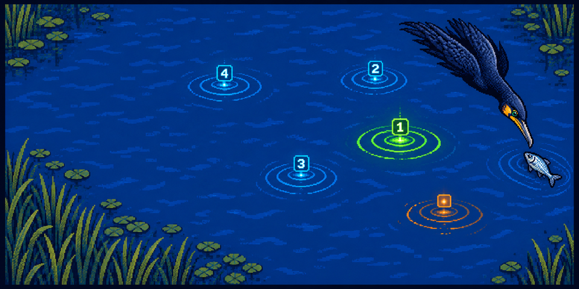

  

<h1 align="center">Aerial Fishing Helper</h1>

Aerial Fishing Helper is a RuneLite plugin for aerial fishing at Molch Island. It watches the fishing spots around you, works out which one your cormorant can catch from fastest, and numbers them so the best spot to click next is obvious at a glance. It weighs how close each spot is, how soon it will move away, and where frenzied pools really fit — so the order reflects what actually earns you the most catches per hour. It only draws on the screen: it never moves your mouse or presses a key for you.

## Features

### The best spot to click, numbered

- **Always know what to click next**

  Every fishing spot is outlined and given a priority number, updated each tick. The number `1` spot is the fastest one to click right now; work down the list as you go. Turn on "highlight best only" if you'd rather see just the single top pick.

### Speed-first ranking

- **Faster spots win, frenzy included**

  Catches are quicker the closer a spot is — one tick within two tiles, two ticks at three or four, three ticks at five. The plugin ranks by that catch speed, so a nearby 1- or 2-tick spot always beats a frenzied pool, which catches on a flat 3-tick cycle no matter how close it is. Frenzied pools are treated as their own 3-tick tier and only jump ahead of a plain 3-tick spot, never ahead of something faster.

### Skips spots about to move

- **No wasted clicks**

  Fishing spots drift to a new tile every several seconds. If a spot is likely to move before your cormorant could reach it, the plugin drops it from the ranking instead of sending you after it — so the number you click is one you'll actually catch from.

### Tick and expiry timers

- **See the clock on every spot**

  Each spot can show its estimated catch time in ticks and a small countdown pie for how much of its life is left before it relocates. A spot that's about to move is recolored so you can tell at a glance which ones are on their way out.

### Make it yours

- **Tune the overlay to taste**

  Choose how many spots to number, whether to show the catch-tick label, how each spot's expiry is shown — none, a smooth countdown pie, or a seconds countdown to a tenth of a second — and the colors for the best spot, the rest, and expiring spots. Advanced tick constants — a spot's expected lifetime and how far out to still consider a spot — are exposed for fine-tuning. Frenzied pools are detected automatically and ranked as a flat 3-tick tier; a toggle turns that off if you'd rather rank purely by distance.

> **Tip:** RuneLite's built-in **Fishing** plugin also highlights these spots. To avoid two sets of tiles fighting, turn off its *Show fishing spot tiles* / *Show fishing spot icons* options (or disable the Fishing plugin) and let Aerial Fishing Helper own the visuals.

## Links

- [Report a bug](https://github.com/Oveduumnakal/Aerial-Fishing-Plugin/issues/new?template=bug_report.yml)
- [Request a feature](https://github.com/Oveduumnakal/Aerial-Fishing-Plugin/issues/new?template=feature_request.yml)
- [Buy me a coffee](https://buymeacoffee.com/oveduumnakal)
